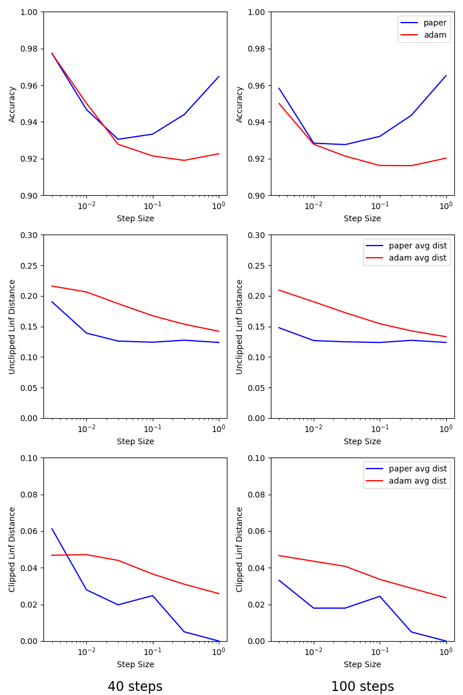
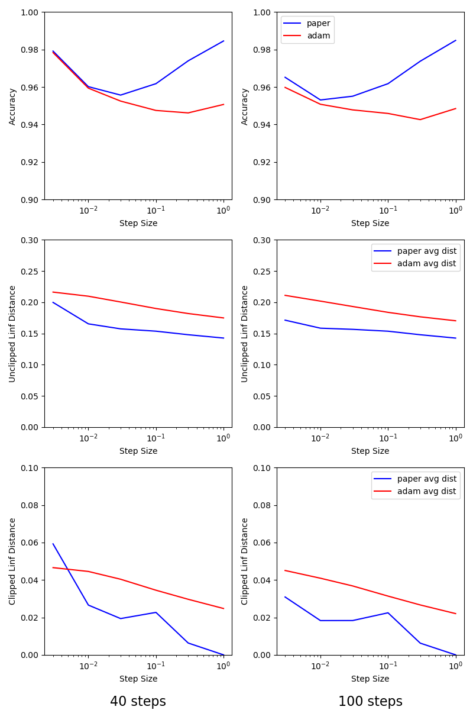

# Adam Results

### TODO:
* Run the code with restarts, see how that affects things.
* Try smaller and larger numbers of steps.
  - It's very plausible that with a large enough step size Adam will
  do pretty well with a small number of steps, which would save a lot
  of time training the networks to attack.
* Try even higher learning rates for Adam, having only one data point
at the end where accuracy rises is a little unsatisfying.

### Short version:

* Adam seems to produce better results than the paper's step-taking
  method.
    - This is true regardless of whether the adversarial training was
      done with Adam or with the paper's step-taking method.
* Adam seems to do a better job of adversarial training than the paper's step-taking method.
* Adam seems to prefer a higher step size than the paper's step-taking method.
  - In line with this, Adam seems to get less close to the shell with
    smaller step sizes than the paper's step-taking method.
* With a large enough step size, 100 steps doesn't seem to help that much vs. 40.

### Long version:

I tried both Adam and the paper's step-taking algorithm vs. a network
adversarially trained with both Adam (lr=0.3, steps=40) and the
paper's step-taking algorithm (lr=0.01, steps=40).  Results are
below.

I also tried to measure the distance to the shell for both of them.
This turned out to be kind of not the right thing, for two reasons:

#### Linf distance sucks

1. Looking at the linf distance to the shell (in the sense of `d(x, y)
= (|x - y|).max()`) didn't really measure the thing we cared about
because it was basically random ("how well-behaved was the
worst-behaved dimension out of a bunch of them").

2. Looking at `d(x, y) = (|x - y|).min()` seemed like it might be
helpful, because for a small step size you would expect to never reach
the shell for any dimension, but in practice with random starts
usually you reach the shell with at least one, so this was just
constant.  (And for non-random starts you run into the clipped-shell
problem below.)

3. I ended up looking at `d(x, y) = (|x - y|).mean()`, which I guess you
could argue kind of makes sense, and produces graphs which are at
least interesting.

#### The shell sucks

We have an linf shell around our image, but we also clip the pixel
values to be in the range `[0, 1)`.  So our actual shell is the linf
shell clipped to those values.

1. If we consider distance the the unclipped shell, we have the
annoying property that we can't actually reach the shell, so no matter
what the step-taking algorithm is doing we stop getting closer to it
at some point.

2. If we consider the distance to the clipped shell, we have the
annoying property that images with lots of white start out with most
of the pixels already on the shell, which makes `d(x, y) = (x -
y).min()` useless even if you have a fixed starting point.

## Graphs

I ended up graphing accuracy vs. step size for 40 and 100 steps, and
also avg. linf distance vs. step size for both the clipped and
unclipped distance.

#### Attacks against an adversarially-trained network using the paper's step-taking algorithm:

#### Attacks against an adversarially-trained network using Adam:

## Thoughts

* It's interesting that in the case of the paper's step-taking method,
  the optimal step size for accuracy is also the step size where
  distance bottoms out, but that this doesn't seem to be true for
  Adam.
* It's interesting that Adam needs such a large step size to get close
  to the shell.
* It's interesting that going from 40 to 100 steps improves accuracy,
  especially for small step sizes, but doesn't seem to have a huge
  effect on how close to the shell we get.
  - It's possible that being super close to the shell is actually a
    failure mode.  In the case of the paper's step-taking algorithm,
    this is clearly true for large step sizes, where it will eventually
    throw itself all the way to the shell every step.
