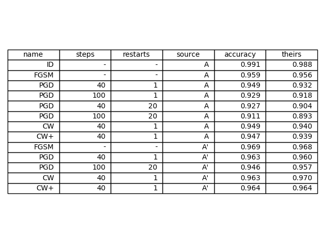

# Overview

All results are compared to https://arxiv.org/pdf/1706.06083.pdf

I reproduced the graphs in section 5, Experiments, for MNIST but not
for CIFAR.  It would potentially be interesting to reproduce figures 1
and 2 from the earlier sections as well.

Their adversarial training scheme is super slow (40 steps of PGD per
outer step of training), so I didn't reproduce the CIFAR results yet.

# Experiment 1 (Figure 4)

## Theirs:

## Ours:

## Thoughts

Overall these look very similar.  Our capacity 4/8 seems to be
behaving slightly differently, not sure why, should probably re-run
the training and see if it was just an outlier.

# Experiment 2 (Figure 5)

## Theirs:

## Ours:

## Thoughts

Overall these look very similar.  Our capacity 4/8 seems to be
behaving slightly differently, not sure why, should probably re-run
the training and see if it was just an outlier.

# Experiment 3 (Table 1)

## Theirs:

## Ours:

## Thoughts

TODO, Targeted, Source B

# Experiment 4 (Figure 6):

## Theirs:

## Ours:

## Thoughts

TODO
