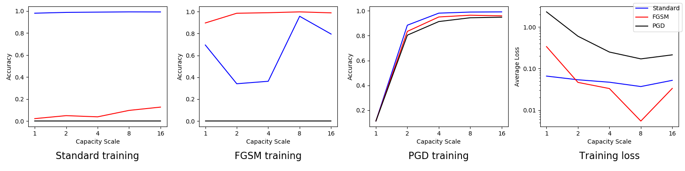
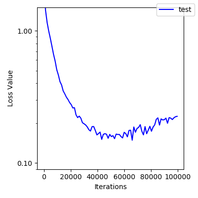

# Overview

All results are compared to https://arxiv.org/pdf/1706.06083.pdf

I reproduced the graphs in Section 5 (Experiments) for MNIST.  It
would potentially be interesting to reproduce figures 1 and 2 from the
earlier sections as well.

Their adversarial training scheme is super slow (40 steps of PGD per
outer step of training), so I didn't reproduce the CIFAR results yet.

To reproduce e.g. experiment 1:
```
cd mnist_aec_pytorch/experiments
python exp1.py
python exp1_plot.py results/exp1.df
open results/exp1.png
```


# Experiment 1 (Figure 4)

## Theirs:


## Ours:



## Thoughts

Not quite the same.  We seem to be doing worse at capacity 4 and
better at capacity 8.  (Also our capacity 2 on PGD training has
already entered the good paradigm.)

I'm not sure if this is random noise from network initialization or if
there's an implementation difference I haven't found.  TODO: look into
this more, re-run the tests.

# Experiment 2 (Figure 5)

## Theirs:


## Ours:



## Thoughts

Overall these look kind of similar.  We seem to bottom out and start
rising in loss earlier than they do and at a slightly higher loss.
That seems suspicious to me, I should double-check the training code.

The difference is less than it looks like because of the log scale.

(This might also explain the persistently-slightly-higher loss in
Experiment 3 if there's some training difference.)

I copied some of the details like batch size from
https://github.com/MadryLab/mnist_challenge , and it seems to give
mostly similar numbers, but it's possible they used a slightly
different configuration for the paper.

# Experiment 3 (Table 1)

## Theirs:


## Ours:


## Thoughts

Everything mostly matches up, our accuracy numbers seem very slightly
higher.

TODO:

* I don't understand the attack they labeled "Targeted", I can't seem
  to find where they describe it in the paper.
* I don't know what to set the confidence parameter to for CW (for CW+
  they specify 50).  I ended up going with 20 (see comments in
  exp3.py).
* Why are our accuracy numbers consistently a little higher?  Seems
  odd, seems true over multiple runs.  Might be nothing.

# Experiment 4 (Figure 6):

## Theirs:


## Ours:


## Thoughts

I haven't implemented the decision boundary attack yet.  Otherwise
very similar, the brown line in the first graph bottoms out faster for
them.
